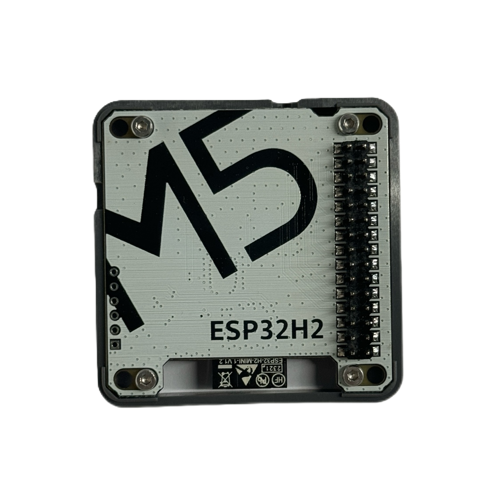
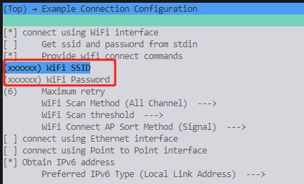
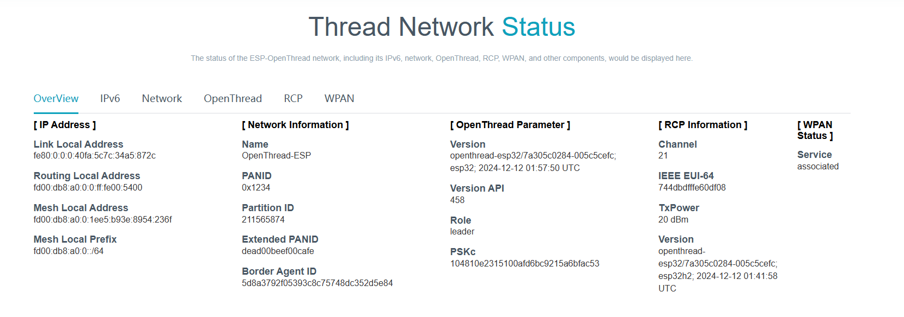
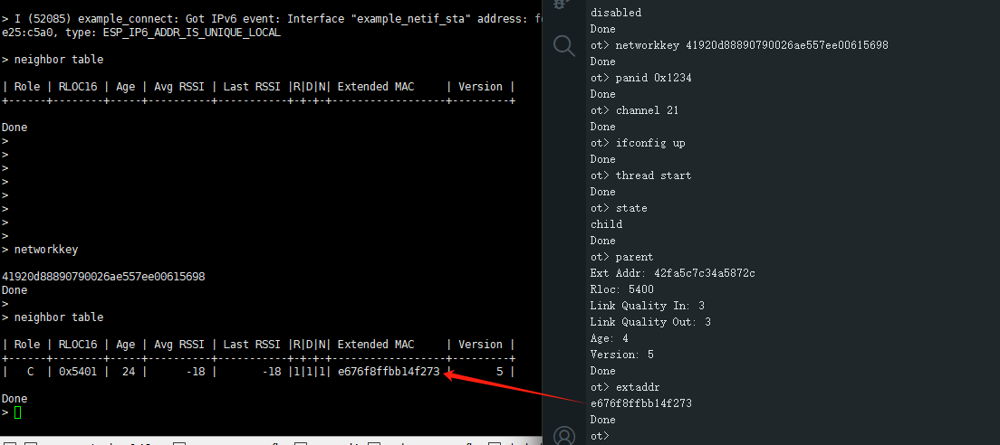

# Module Gateway H2 + CoreS3 运行 ESP Thread Boarder Router


Module Gateway H2 支持搭配ESP32系列 Wi-Fi SoC 运行 ESP Thread Boarder Router SDK，该SDK构建基于ESP-IDF和OpenThread，将Thread网络运行在H2上，H2通过串口与主处理器通信。

你需要准备：
- M5Module-Gateway H2 

  
- M5Stack CoreS3 / M5Stack Core2 / M5Stack Core

  
- Type-C 数据线
- ESP-IDF 环境

## 1. 安装 ESP-IDF
```bash
git clone --recursive https://github.com/espressif/esp-idf.git
cd esp-idf
git checkout v5.3.1 # recommend
./install.sh

. ./export.sh
```

## 2. 编译H2 rcp固件
```bash
cd examples/openthread/ot_rcp
idf.py set-target esp32h2
idf.py build
```

## 3. 编译wifi soc固件
拉取代码
```bash
cd ~
git clone https://github.com/Ocean-lhy/esp-thread-br.git
```

配置soc
```bash
# coreS3
git checkout demo_for_core_s3_test
cd examples/thread_border_router_credential_sharing
idf.py set-target esp32s3
# core2
git checkout demo_for_core_2_test
cd examples/thread_border_router_credential_sharing
idf.py set-target esp32
# core
git checkout demo_for_core_test
cd examples/thread_border_router_credential_sharing
idf.py set-target esp32
```

配置wifi
```bash
idf.py menuconfig
```
在 menuconfig 中配置：
  - Example Connection Configuration
    - 配置 Wi-Fi SSID 和密码

<div align=center></div>

编译烧录固件
```bash
idf.py build
idf.py erase_flash
idf.py flash # 根据实际端口修改
```

# 4. 运行
烧录后重启设备，设备进入rcp update状态。在rcp update成功后，设备将重启、连接wifi和Thread网络。在一段时间后（最长不应超过60s），设备初始化完成，m5stack的屏幕上出现以下信息：
1. `Espressif`标志
2. `generate epskc`按钮
3. `factoryreset`按钮
4. Border router web server网址

<div align=center></div>

在m5stack的屏幕上点击`generate epskc`按钮，设备将生成一个epskc，并显示在屏幕上。

在局域网内，使用浏览器访问Border router web server网址，可以查看Thread网络信息。

<div align=center></div>

# 5. 测试
使用一个ESP32H2(Module Gateway H2)或ESP32C6(M5NanoC6)，烧录[openthread](../Device/openthread.md)的SimpleCLI例程，连接到Thread网络，查看Thread网络信息。

1. 在ThreadBoarderRouter的后台输入`networkkey`、`panid`、`channel`，获取Thread网络的网络密钥、panid和channel。
2. 在SimpleCLI例程中输入配置命令并启动Thread网络
```bash
networkkey <networkkey>
panid <panid>
channel <channel>
ifconfig up
thread start
```
3. 在SimpleCLI后台输入`state`，查看Thread网络状态，如果作为child/router连接上网络，则Thread网络连接成功。如果作为leader成立网络，则配置可能有误。
4. 在SimpleCLI后台输入`parent`，查看Thread网络的父节点；输入`extaddr`，查看此节点的扩展地址。
5. 在ThreadBoarderRouter的后台输入`extaddr`，查看此节点的扩展地址，应与SimpleCLI例程中的`parent extaddr`一致。
6. 在ThreadBoarderRouter的后台输入`neighbor table`，查看Thread网络的邻居节点，应包含SimpleCLI例程的节点。

<div align=center></div>
