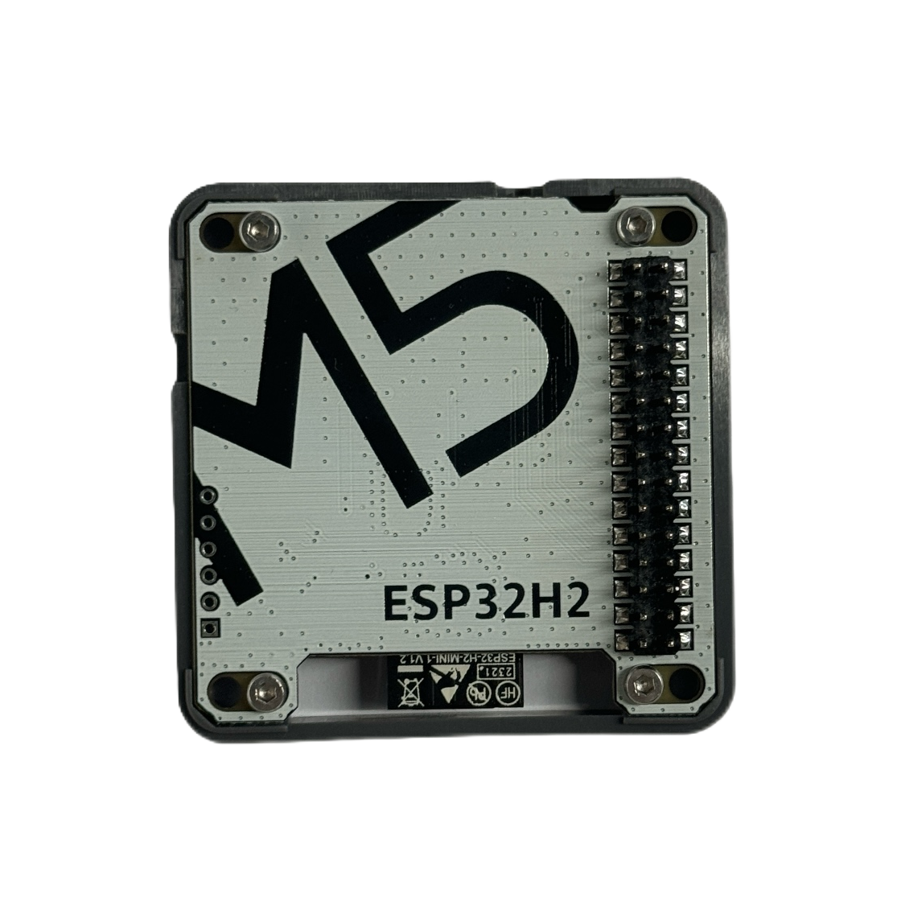

# Module Gateway H2 + CoreS3 运行 ESP Zigbee NCP

ESP Zigbee NCP (Network Co-Processor) 是一种网络协处理器模式，它将 Zigbee 协议栈运行在一个独立的处理器上，通过串口与主处理器通信。这种架构可以让主处理器专注于应用层逻辑，而将 Zigbee 网络相关的处理交给协处理器处理。
Module Gateway H2 支持搭配 ESP32 系列 Wi-Fi SoC 运行 ESP Zigbee NCP，该方案基于 ESP-IDF 和 ESP Zigbee SDK 构建，使用了Zigbee Home Automation标准协议。

你需要准备：
- M5Module-Gateway H2（作为 NCP）
- M5Stack CoreS3（作为 Host）
- Type-C 数据线
- ESP-IDF 环境

## 1. 安装 ESP-IDF
```bash
git clone --recursive https://github.com/espressif/esp-idf.git
cd esp-idf
./install.sh

. ./export.sh
```

## 2. 克隆 ESP-Zigbee-SDK 仓库
```bash
git clone --recursive https://github.com/espressif/esp-zigbee-sdk.git
cd esp-zigbee-sdk
```

## 3. 编译 H2 NCP 固件

### 3.1 配置 NCP
```bash
cd examples/esp_zigbee_ncp
idf.py set-target esp32h2
idf.py menuconfig
```

在 menuconfig 中需要配置：
- Component config → Zigbee Network Co-processor
  - UART TX Pin: 24
  - UART RX Pin: 23
- Component config → ESP Zigbee → Configure the Zigbee device type
  - Zigbee Coordinator or Router device # or Zigbee End Device

### 3.2 编译和烧录
```bash
idf.py build
idf.py erase_flash
idf.py flash # 根据实际端口修改
```

## 4. 编译 Host 固件

### 4.1 配置 Host
```bash
cd examples/esp_zigbee_host
idf.py set-target esp32s3 # 使用 CoreS3
idf.py menuconfig
```

在 menuconfig 中配置：
- Component config → Zigbee NCP Host
  - UART TX Pin: 35
  - UART RX Pin: 17

### 4.2 编译和烧录
```bash
idf.py build
idf.py -p /dev/ttyACM1 flash # 根据实际端口修改
```

## 5. 运行

1. 将H2模块插入CoreS3
2. 将CoreS3连接电脑
3. 查看串口

正常运行时可以看到：
- NCP 端显示 Zigbee 协议栈初始化成功
- Host 端显示与 NCP 连接成功
- Zigbee 网络创建成功（Coordinator 模式）
